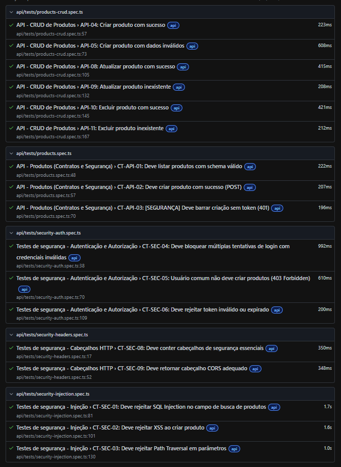
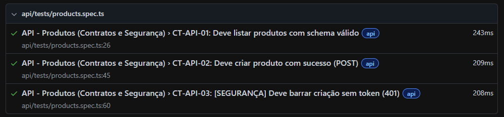
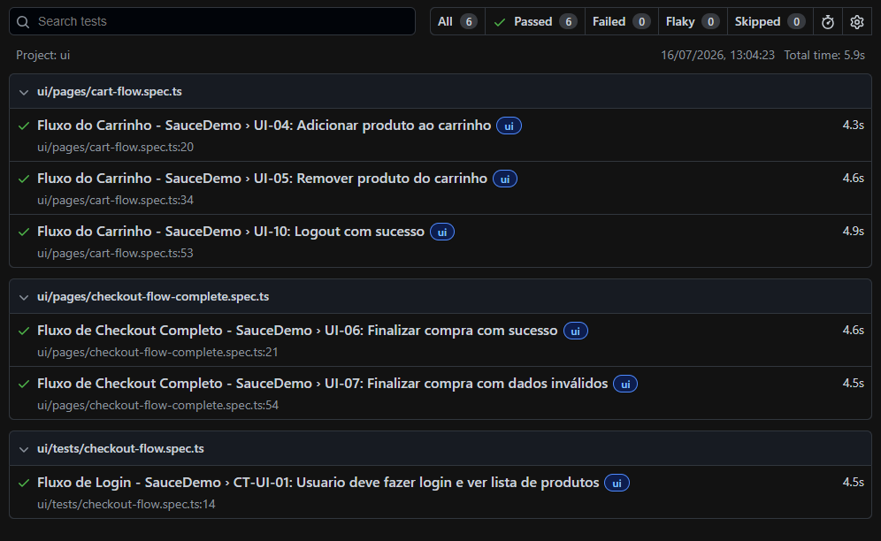
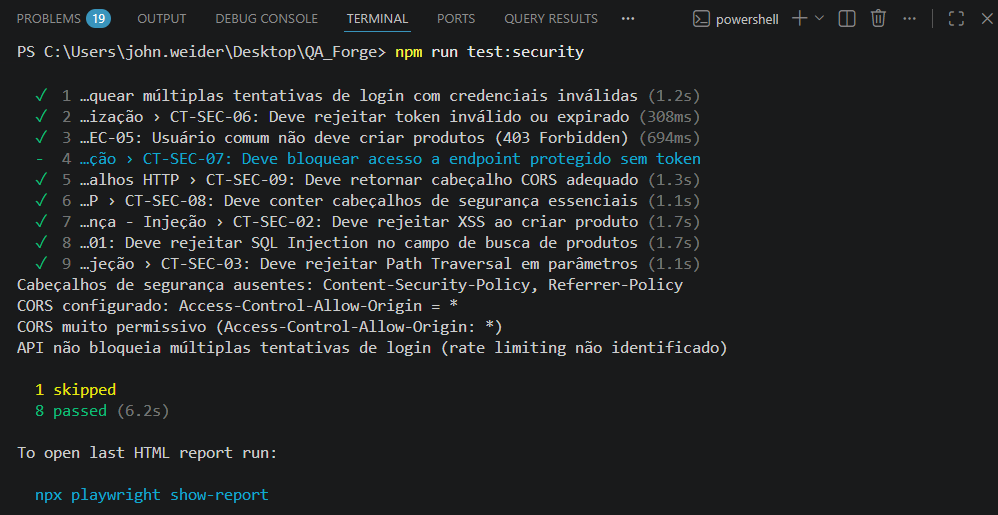
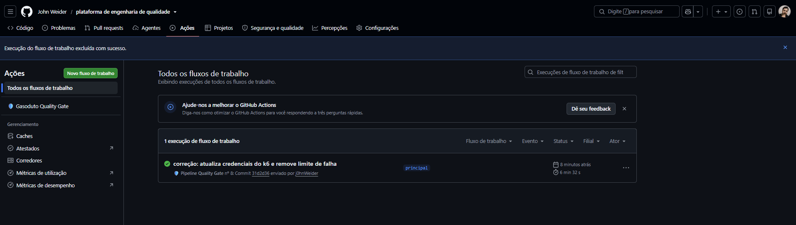

```markdown
# Quality Engineering Platform

Framework de automação de testes com arquitetura híbrida, abrangendo API, interface, performance e segurança, com pipeline CI/CD integrado.

Projeto criado para demonstrar competências em engenharia de qualidade, com foco em **automação robusta**, **rastreabilidade** e **entrega contínua**. A arquitetura utiliza duas plataformas distintas para maximizar a estabilidade e a cobertura de testes.

---

## Arquitetura de testes híbrida

O projeto utiliza duas plataformas distintas, cada uma escolhida por sua estabilidade e adequação ao tipo de teste.

| Categoria | Plataforma | Motivo |
|-----------|------------|--------|
| **Testes de API** | [Serverest](https://serverest.dev) | API real para contrato, auth e injeção. |
| **Testes de UI** | [SauceDemo](https://www.saucedemo.com) | UI estável para fluxos de compra. |
| **Performance** | [SauceDemo](https://www.saucedemo.com) | Teste de carga e recursos estáticos. |
| **Segurança** | [SauceDemo](https://www.saucedemo.com) | Varredura passiva com OWASP ZAP. |

Essa abordagem demonstra adaptação a diferentes sistemas e garante testes mais confiáveis e com menor flakiness.
---

## Visão geral

- **Testes de API** com validação de contrato, autenticação, autorização e cenários de injeção (SQL, XSS, Path Traversal).
- **Testes de interface** com Page Objects e fluxo de login (SauceDemo).
- **Testes de performance** com k6, com limiares de tempo de resposta.
- **Varredura de segurança** passiva com OWASP ZAP, integrada ao pipeline.
- **Pipeline CI/CD** automatizado no GitHub Actions, executado a cada push na branch `main`.
- **Geração de relatórios** HTML do Playwright e ZAP.

---

## Tecnologias utilizadas

- **TypeScript** – tipagem estática e melhor manutenção.
- **Playwright** – orquestrador unificado para testes de API e UI.
- **k6** – testes de performance.
- **OWASP ZAP** – scanner de segurança passivo.
- **GitHub Actions** – pipeline de integração contínua.
- **Docker** – execução do ZAP no pipeline.
```
---

## Estrutura do projeto

```bash
src/
  api/
    client/           # Cliente HTTP reutilizável (Serverest)
    tests/            # Specs de API (Serverest)
      products.spec.ts           # CRUD e validação de contrato
      security-injection.spec.ts # SQL, XSS, Path Traversal
      security-auth.spec.ts      # Autenticação e autorização
      security-headers.spec.ts   # Cabeçalhos de segurança
  ui/
    pages/            # Page Objects (SauceDemo)
    tests/            # Specs de UI (SauceDemo)
  performance/        # Scripts k6 (SauceDemo)
  security/           # Scripts para OWASP ZAP (SauceDemo)
  utils/              # Funções auxiliares
reports/              # Relatórios gerados
imagens/              # Prints dos resultados
.github/workflows/    # Pipeline CI/CD
```

---

## Pré-requisitos

- Node.js (v18 ou superior)
- npm ou yarn
- Playwright (`npx playwright install`)
- k6 (para execução local) – [instalação](https://k6.io/docs/get-started/installation/)
- Docker (para execução do ZAP local ou no pipeline)
```
---
```
## Como executar localmente

1. Clone o repositório:

```bash
git clone https://github.com/j0hnWeider/quality-engineering-platform.git
cd quality-engineering-platform
```

2. Instale as dependências:

```bash
npm install
npx playwright install
```

3. Configure as variáveis de ambiente (opcional):

```bash
cp .env.example .env
# edite .env se necessário
```

4. Execute todos os testes (API + UI):

```bash
npm run test:all
```

5. Execute apenas os testes de API (Serverest):

```bash
npm run test:api
```

6. Execute apenas os testes de UI (SauceDemo):

```bash
npm run test:ui
```

7. Execute o teste de performance (k6):

```bash
npm run test:perf
```

8. Execute o scan de segurança (requer Docker):

```bash
npm run test:zap
```

O relatório do ZAP será gerado em `reports/zap-report.html`.

---

## Resultados dos testes

### Visão geral consolidada



*Relatório completo do Playwright com todos os testes (API, UI e segurança) passando.*

---

### Testes de API (Serverest)



### Testes de UI (SauceDemo)



### Testes de segurança ativos



### Pipeline CI/CD no GitHub Actions


---

## Pipeline CI/CD

O pipeline definido em `.github/workflows/ci-quality-gate.yml` executa as seguintes etapas em cada push ou pull request para a branch `main`:

- Instalação de dependências (`npm ci`)
- Instalação dos navegadores do Playwright
- Instalação do k6 (para testes de performance)
- Testes de API (Serverest)
- Testes de UI (SauceDemo)
- Teste de performance (k6)
- Scan de segurança passivo (OWASP ZAP)

**O pipeline falha** caso:
- Algum teste funcional (API ou UI) falhe.
- O limiar de performance seja violado.
- O ZAP identifique vulnerabilidades de nível "Alta".

---

## Decisões técnicas

- **Playwright**: escolhido por oferecer uma API unificada para testes de API e UI, reduzindo a complexidade e o número de ferramentas.
- **TypeScript**: adotado para garantir segurança de tipos, facilitar a refatoração e melhorar a experiência de desenvolvimento.
- **ZAP em modo baseline**: adotado como camada inicial de segurança, sem gerar tráfego ofensivo, analisando apenas respostas para vulnerabilidades conhecidas.
- **Arquitetura híbrida**: utilização de duas plataformas distintas (Serverest para API, SauceDemo para UI/performance/segurança) para garantir estabilidade e cobertura abrangente.
- **Criação dinâmica de usuários**: nos testes de API, contas administradoras são criadas automaticamente via API, garantindo autossuficiência e eliminando dependência de credenciais externas.

---

## Próximos passos (roadmap)

- [ ] Testes de contrato com Pact (consumer-driven)
- [ ] Testes de acessibilidade com axe-core
- [ ] Dashboard com métricas históricas
- [ ] Parametrização da URL base para diferentes ambientes (dev, staging, produção)

---

## Autor

**John Weider** – Engenheiro de QA  
Pós-graduado em Engenharia de Software  
Graduação em Defesa Cibernética

[LinkedIn](https://www.linkedin.com/in/john-weider-98bb041b2/)  
E-mail: zeus.programador@gmail.com
```

