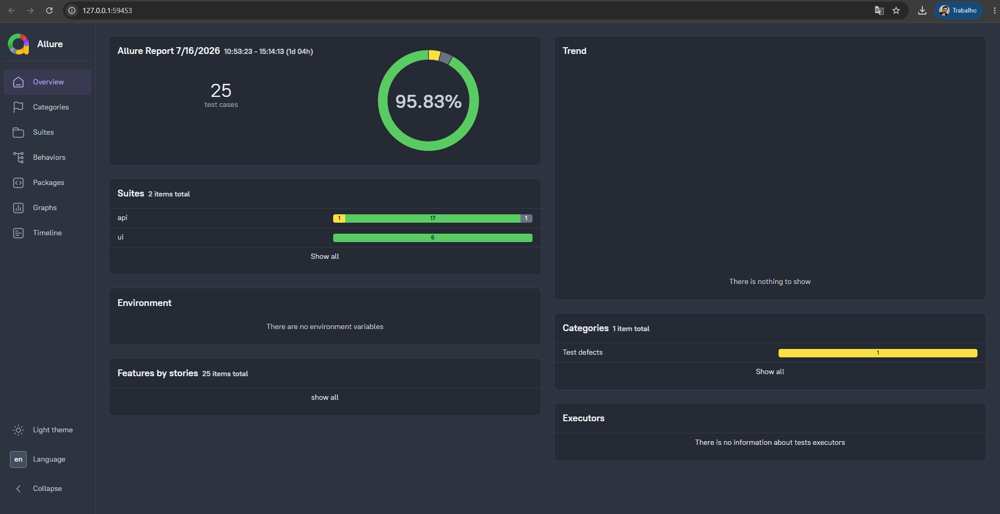

<div align="center">
  
<<<<<<< HEAD
  <br>
=======
  <br><br>
>>>>>>> 1dea5d200f83ea0508aea2a8b3df4db359208a31
</div>

<div align="center">

# QA Forge

**Laboratório de Engenharia de Qualidade**  
<<<<<<< HEAD
API · Interface · Performance · Segurança · Contrato · CI/CD
=======
API · Interface · Performance · Segurança · CI/CD
>>>>>>> 1dea5d200f83ea0508aea2a8b3df4db359208a31

> O repositório permanece com o nome **quality-engineering-platform** por questões de versionamento, mas toda a documentação e evolução do projeto utilizam a identidade **QA Forge**.

<p align="center">
  
  
  
  
</p>

<p align="center">
  
  
  
  
  
  
<<<<<<< HEAD
  
=======
>>>>>>> 1dea5d200f83ea0508aea2a8b3df4db359208a31
</p>

</div>

---

## Contexto e Problema

Em projetos de software, a garantia de qualidade frequentemente enfrenta desafios como:

- Suítes de testes monolíticas e de difícil manutenção.
- Baixa cobertura de testes não funcionais (performance, segurança).
- Ausência de integração contínua com validação automatizada.
- Dificuldade em gerar relatórios claros e rastreáveis.
<<<<<<< HEAD
- Quebra de contratos entre consumidores e provedores de API.
=======
>>>>>>> 1dea5d200f83ea0508aea2a8b3df4db359208a31

O **QA Forge** foi criado para resolver esses problemas em um ambiente controlado, aplicando práticas modernas de engenharia de qualidade em cenários realistas, inspirados em minha experiência profissional com desenvolvimento de software e arquitetura de aplicações.

---

## Abordagem e Solução

A solução adotada consiste em uma arquitetura modular, com camadas independentes para cada tipo de teste, e um pipeline de CI/CD que executa todas as validações automaticamente. A escolha de ferramentas e a estruturação do projeto foram orientadas pelos seguintes princípios:

<<<<<<< HEAD
- **Separação de responsabilidades** – cada módulo (API, UI, Performance, Segurança, Contrato) possui seu próprio conjunto de testes e configurações.
=======
- **Separação de responsabilidades** – cada módulo (API, UI, Performance, Segurança) possui seu próprio conjunto de testes e configurações.
>>>>>>> 1dea5d200f83ea0508aea2a8b3df4db359208a31
- **Reutilização** – clientes HTTP, fixtures e Page Objects são compartilhados entre os testes.
- **Tipagem forte** – TypeScript para garantir segurança e facilitar a manutenção.
- **Integração contínua** – GitHub Actions executa a suíte completa a cada push, com quality gate.
- **Relatórios abrangentes** – Playwright Report, Allure e OWASP ZAP geram evidências detalhadas.

A estratégia de testes combina validações funcionais e não funcionais, distribuídas em diferentes camadas para reduzir flaky tests e aumentar a confiabilidade.

---

## Matriz de Qualidade

| Categoria | Objetivo | Ferramenta | Status |
|-----------|----------|------------|:------:|
| API Testing | CRUD, autenticação, autorização e contratos | Playwright | OK |
| UI Testing | Fluxos End-to-End | Playwright | OK |
| Security Testing | SQL Injection, XSS, Path Traversal e Headers | Playwright | OK |
| Performance Testing | Carga e tempo de resposta | k6 | OK |
| Vulnerability Scan | Scanner passivo | OWASP ZAP | OK |
<<<<<<< HEAD
| Contract Testing | Testes de contrato orientados pelo consumidor | Pact | OK |
=======
>>>>>>> 1dea5d200f83ea0508aea2a8b3df4db359208a31
| Test Reports | Relatórios HTML | Playwright Report | OK |
| Dashboards | Relatórios avançados | Allure Report | OK |
| CI/CD | Pipeline automatizado | GitHub Actions | OK |
| Mutation Testing | Qualidade da suíte | Stryker | OK |
| Code Coverage | Cobertura de código | NYC | OK |
| Code Quality | Padronização | ESLint + Prettier | OK |

---

<<<<<<< HEAD
## Testes de Contrato com Pact

Os **Testes de Contrato** validam a compatibilidade entre consumidores e provedores de API sem a necessidade de testes de integração completos. Utilizando o **Pact** (Consumer-Driven Contracts), os contratos são gerados pelos consumidores e verificados pelos provedores.

### Estrutura

```
src/contract/
├── consumer/
│   ├── pact-helper.ts                    # Configuração centralizada do PactV4
│   └── products-consumer.spec.ts         # Testes do consumidor (5 cenários)
├── provider/
│   └── products-provider.spec.ts         # Verificação do provedor (3 cenários)
└── pacts/
    └── .gitkeep                          # Contratos gerados (ignorados pelo git)
```

### Fluxo de Trabalho

```text
Consumer Test (QA Forge WebApp)
  │
  ├── Define interações esperadas (request + response)
  ├── Mock Provider valida as chamadas reais do ApiClient
  └── Gera arquivo pact (contrato JSON)
         │
         ▼
Provider Verification (Serverest API)
  │
  ├── Lê o contrato gerado
  ├── Executa requisições reais contra o provider
  └── Compara resposta real com o contrato esperado
```

### Cenários Implementados

| ID | Cenário | Método | Endpoint |
|----|---------|--------|----------|
| CT-CONTRACT-01 | Listar produtos com schema válido | GET | /produtos |
| CT-CONTRACT-02 | Criar produto com sucesso | POST | /produtos |
| CT-CONTRACT-03 | Criar produto sem autenticação (401) | POST | /produtos |
| CT-CONTRACT-04 | Atualizar produto existente | PUT | /produtos/:id |
| CT-CONTRACT-05 | Excluir produto existente | DELETE | /produtos/:id |
| CT-PROVIDER-01 | Verificação automática do contrato | - | GET /produtos |
| CT-PROVIDER-02 | Validação manual do schema da resposta | - | GET /produtos |
| CT-PROVIDER-03 | Provider retorna 401 sem autenticação | POST | /produtos |

### Comandos

```bash
# Executar testes de contrato do consumidor (gera os contratos)
npm run test:contract:consumer

# Executar verificação do provedor
npm run test:contract:provider

# Executar todos os testes de contrato
npm run test:contract
```

---

## Arquitetura do Projeto

=======
## Arquitetura do Projeto

>>>>>>> 1dea5d200f83ea0508aea2a8b3df4db359208a31
O projeto é organizado de forma modular, permitindo evolução independente de cada camada.

```text
QA Forge
│
├── API Testing
│   ├── Cliente HTTP
│   ├── Fixtures
│   ├── Testes Funcionais
│   └── Testes de Segurança
│
├── Contract Testing
│   ├── Pact
│   ├── Consumer Tests
│   └── Provider Verification
│
├── UI Testing
│   ├── Page Objects
│   ├── Fluxos E2E
│   └── Componentes
│
├── Performance
│   └── k6
│
├── Security
│   └── OWASP ZAP
│
├── Reports
│   ├── Playwright
│   └── Allure
│
└── GitHub Actions
Stack Tecnológica
Categoria	Tecnologia
Linguagem	TypeScript
Testes	Playwright, k6, OWASP ZAP
Qualidade de Código	ESLint, Prettier, NYC, Stryker
Relatórios	Allure, Playwright Report
CI/CD	GitHub Actions, Docker
Ambientes Híbridos
Para reduzir dependências e flaky tests, cada camada utiliza um ambiente específico:

<<<<<<< HEAD
---

## Stack Tecnológica

| Categoria | Tecnologia | Finalidade |
|-----------|------------|------------|
| Linguagem | TypeScript | Segurança de tipos e manutenção |
| Testes | Playwright | Automação de API e Interface |
| Contrato | Pact | Testes de contrato orientados pelo consumidor |
| Performance | k6 | Testes de carga |
| Segurança | OWASP ZAP | Scanner passivo de vulnerabilidades |
| Qualidade de Código | ESLint, Prettier, NYC, Stryker | Padronização, cobertura e mutação |
| Relatórios | Allure, Playwright Report | Dashboards e evidências |
| CI/CD | GitHub Actions, Docker | Pipeline automatizado |

---

## Ambientes Híbridos

Para reduzir dependências e flaky tests, cada camada utiliza um ambiente específico:

| Camada | Plataforma |
|---------|------------|
| API | Serverest |
| UI | SauceDemo |
| Performance | SauceDemo |
| Segurança | SauceDemo |

---

## Estrutura de Diretórios

```text
=======
Camada	Plataforma
API	Serverest
UI	SauceDemo
Performance	SauceDemo
Segurança	SauceDemo
Estrutura de Diretórios
text
>>>>>>> 1dea5d200f83ea0508aea2a8b3df4db359208a31
qa-forge
│
├── .github/workflows/          # Pipeline CI/CD
├── allure-results/             # Resultados para Allure
├── imagens/                    # Imagens do README
├── playwright-report/          # Relatório HTML do Playwright
├── reports/                    # Relatórios personalizados (ZAP, etc.)
├── src/
│   ├── api/                    # Testes de API
│   │   ├── client/             # Cliente HTTP
│   │   ├── fixtures/           # Massa de dados
│   │   └── tests/              # Cenários funcionais e de segurança
<<<<<<< HEAD
│   ├── contract/               # Testes de Contrato com Pact
│   │   ├── consumer/           # Testes do consumidor
│   │   ├── provider/           # Verificação do provedor
│   │   └── pacts/              # Contratos gerados
=======
>>>>>>> 1dea5d200f83ea0508aea2a8b3df4db359208a31
│   ├── ui/                     # Testes de Interface
│   │   ├── pages/              # Page Objects
│   │   └── tests/              # Fluxos End-to-End
│   ├── performance/            # Scripts k6
│   └── security/               # Scanner OWASP ZAP
├── test-results/               # Evidências da execução
├── .env.example
├── playwright.config.ts
├── package.json
└── README.md
Evidências
Resultados obtidos na última execução completa da suíte:

Visão Geral	Testes de API
https://imagens/all-tests-passing.png	https://imagens/api-tests-passing.png
Testes de Interface	Testes de Segurança
https://imagens/ui-tests-passing.png	https://imagens/security-tests-passing.png
OWASP ZAP	Pipeline CI/CD
https://imagens/security-report-passing.png	https://imagens/pipeline-passing.png
Relatório Allure
https://imagens/allure-report-passing.png
Como Reportar Resultados
Os relatórios gerados após cada execução são os principais artefatos para comunicação de resultados:

<<<<<<< HEAD
## Evidências

Resultados obtidos na última execução completa da suíte:

| Visão Geral | Testes de API |
|-------------|---------------|
|  |  |

| Testes de Interface | Testes de Segurança |
|---------------------|---------------------|
|  |  |

| OWASP ZAP | Pipeline CI/CD |
|-----------|----------------|
|  |  |

**Relatório Allure**



---

## Como Reportar Resultados

Os relatórios gerados após cada execução são os principais artefatos para comunicação de resultados:

- **Playwright HTML Report** – `playwright-report/index.html` – detalhamento de cada teste, com evidências em vídeo/screenshot.
- **Allure Report** – acessível via `npm run report:allure` – dashboard interativo com histórico e métricas.
- **OWASP ZAP Report** – `reports/` – lista de vulnerabilidades encontradas.
- **Pipeline Summary** – no GitHub Actions, com status de cada etapa e links para os artefatos.

Para reportar um problema ou sugerir melhoria, abra uma Issue no repositório, descrevendo o cenário, o comportamento esperado e o observado, anexando evidências quando possível.

---

## Primeiros Passos

### Pré-requisitos

- Node.js 18+
- npm 9+
- Docker (para OWASP ZAP)
- Playwright browsers: `npx playwright install`

### Instalação

```bash
=======
Playwright HTML Report – playwright-report/index.html – detalhamento de cada teste, com evidências em vídeo/screenshot.

Allure Report – acessível via npm run report:allure – dashboard interativo com histórico e métricas.

OWASP ZAP Report – reports/ – lista de vulnerabilidades encontradas.

Pipeline Summary – no GitHub Actions, com status de cada etapa e links para os artefatos.

Para reportar um problema ou sugerir melhoria, abra uma Issue no repositório, descrevendo o cenário, o comportamento esperado e o observado, anexando evidências quando possível.

Primeiros Passos
Pré-requisitos
Node.js 18+

npm 9+

Docker (para OWASP ZAP)

Playwright browsers: npx playwright install

Instalação
bash
>>>>>>> 1dea5d200f83ea0508aea2a8b3df4db359208a31
git clone https://github.com/j0hnWeider/quality-engineering-platform.git
cd quality-engineering-platform
npm install
npx playwright install
cp .env.example .env   # opcional
<<<<<<< HEAD
```

### Comandos Principais

| Comando | Descrição |
|---------|-----------|
| `npm run test:all` | Executa toda a suíte (API + UI + Contrato) |
| `npm run test:api` | Apenas testes de API |
| `npm run test:ui` | Apenas testes de interface |
| `npm run test:contract` | Testes de contrato com Pact |
| `npm run test:contract:consumer` | Testes do consumidor (gera contratos) |
| `npm run test:contract:provider` | Verificação do provedor |
| `npm run test:perf` | Testes de performance com k6 |
| `npm run test:security` | Testes de segurança ativos |
| `npm run test:zap` | Scanner OWASP ZAP |
| `npm run report:allure` | Gera e exibe relatório Allure |
| `npm run coverage` | Relatório de cobertura de código |
| `npm run lint` / `npm run lint:fix` | Análise e correção de código |
| `npm run format` | Formatação com Prettier |

---

## Pipeline CI/CD

O pipeline do GitHub Actions é acionado a cada push na branch main e executa as seguintes etapas:

1. Instalação de dependências
2. Instalação dos navegadores Playwright
3. Testes de API
4. Testes de Contrato (Consumer)
5. Testes de UI
6. Testes de performance
7. Scanner OWASP ZAP
8. Geração de relatórios e publicação de artefatos

Qualquer falha crítica interrompe o fluxo, impedindo a integração de alterações que não atendam aos critérios de qualidade definidos.

---

## Decisões Técnicas

| Decisão | Motivação |
|---------|-----------|
| Playwright | Framework único para API e UI, reduzindo complexidade. |
| TypeScript | Tipagem estática para maior segurança e manutenibilidade. |
| Pact (Contract Testing) | Validação de compatibilidade consumidor/provedor sem dependência de ambiente integrado. |
| Arquitetura Híbrida | Ambientes distintos para cada camada, reduzindo flaky tests. |
| Page Object Model | Centralização de elementos e ações da interface. |
| Cliente HTTP Reutilizável | Padronização e redução de duplicação. |
| OWASP ZAP Baseline | Varredura passiva sem testes destrutivos. |
| GitHub Actions | Automação da execução a cada alteração. |

---

## Roadmap

| Funcionalidade | Status |
|----------------|:------:|
| Testes de Contrato com Pact | ✅ |
| Testes de Acessibilidade com axe-core | ⏳ |
| Visual Regression Testing | ⏳ |
| Testes Mobile com Playwright | ⏳ |
| Execução Paralela Distribuída | ⏳ |
| Integração com SonarQube | ⏳ |
| Dashboard de Métricas | ⏳ |
| Testes orientados por Dados | ⏳ |

---

## Contribuição

Sugestões, discussões e melhorias são bem-vindas. Abra uma issue ou envie um pull request.

---

## Licença

Este projeto está sob a licença MIT. Consulte o arquivo LICENSE para mais detalhes.

---

## Autor

**John Weider**  
Engenheiro de Qualidade | Pós-graduado em Engenharia de Software | Graduado em Defesa Cibernética  

- [LinkedIn](https://www.linkedin.com/in/john-weider)  
- E-mail: zeus.programador@gmail.com

---
=======
Comandos Principais
Comando	Descrição
npm run test:all	Executa toda a suíte (API + UI)
npm run test:api	Apenas testes de API
npm run test:ui	Apenas testes de interface
npm run test:perf	Testes de performance com k6
npm run test:security	Testes de segurança ativos
npm run test:zap	Scanner OWASP ZAP
npm run report:allure	Gera e exibe relatório Allure
npm run coverage	Relatório de cobertura de código
npm run lint / npm run lint:fix	Análise e correção de código
npm run format	Formatação com Prettier
Pipeline CI/CD
O pipeline do GitHub Actions é acionado a cada push na branch main e executa as seguintes etapas:

Instalação de dependências

Instalação dos navegadores Playwright

Testes de API

Testes de UI

Testes de performance

Scanner OWASP ZAP

Geração de relatórios e publicação de artefatos

Qualquer falha crítica interrompe o fluxo, impedindo a integração de alterações que não atendam aos critérios de qualidade definidos.

Decisões Técnicas
Decisão	Motivação
Playwright	Framework único para API e UI, reduzindo complexidade.
TypeScript	Tipagem estática para maior segurança e manutenibilidade.
Arquitetura Híbrida	Ambientes distintos para cada camada, reduzindo flaky tests.
Page Object Model	Centralização de elementos e ações da interface.
Cliente HTTP Reutilizável	Padronização e redução de duplicação.
OWASP ZAP Baseline	Varredura passiva sem testes destrutivos.
GitHub Actions	Automação da execução a cada alteração.
Roadmap
Funcionalidade	Status
Testes de Contrato com Pact	Pendente
Testes de Acessibilidade com axe-core	Pendente
Visual Regression Testing	Pendente
Testes Mobile com Playwright	Pendente
Execução Paralela Distribuída	Pendente
Integração com SonarQube	Pendente
Dashboard de Métricas	Pendente
Testes orientados por Dados	Pendente
Contribuição
Sugestões, discussões e melhorias são bem-vindas. Abra uma issue ou envie um pull request.

Licença
Este projeto está sob a licença MIT. Consulte o arquivo LICENSE para mais detalhes.

Autor
John Weider
Engenheiro de Qualidade | Pós-graduado em Engenharia de Software | Graduado em Defesa Cibernética

LinkedIn

E-mail: zeus.programador@gmail.com
>>>>>>> 1dea5d200f83ea0508aea2a8b3df4db359208a31

<div align="center">
Se este projeto foi útil, considere deixar uma estrela no repositório.
Construindo qualidade através da prática, experimentação e aprendizado contínuo.

<<<<<<< HEAD
Se este projeto foi útil, considere deixar uma estrela no repositório.  
*Construindo qualidade através da prática, experimentação e aprendizado contínuo.*

</div>
=======
</div> ```
>>>>>>> 1dea5d200f83ea0508aea2a8b3df4db359208a31
