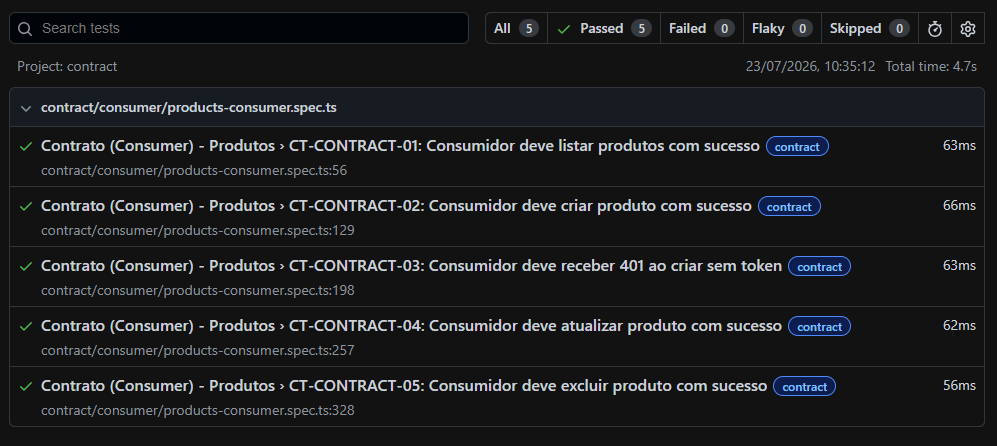

  
    

# QA Forge

**Laboratório de Engenharia de Qualidade**  
API · Interface · Performance · Segurança · Contrato · CI/CD

  
  
  
  

  
  
  
  
  
  
  

---

## Escopo

O QA Forge é um ambiente prático para estudo e aplicação de técnicas modernas de engenharia de qualidade. O projeto aborda:

- Automação de testes de API e interface com Playwright
- Testes de performance com k6
- Testes de segurança (OWASP ZAP e cenários de injeção)
- Testes de contrato com Pact (consumer-driven)
- Pipeline CI/CD com GitHub Actions
- Relatórios interativos com Allure e Playwright Report

---

## Arquitetura e Abordagem

- Arquitetura modular com camadas independentes (API, UI, Performance, Segurança, Contrato)
- Page Object Model para testes de interface
- Cliente HTTP reutilizável para testes de API
- Testes de contrato orientados pelo consumidor com Pact
- Execução automatizada via GitHub Actions com quality gate

---

## Matriz de Qualidade

| Categoria | Ferramenta | Status |
|-----------|------------|:------:|
| API Testing | Playwright | OK |
| UI Testing | Playwright | OK |
| Security Testing | Playwright | OK |
| Performance Testing | k6 | OK |
| Vulnerability Scan | OWASP ZAP | OK |
| Contract Testing | Pact | OK |
| Test Reports | Playwright Report | OK |
| Dashboards | Allure Report | OK |
| CI/CD | GitHub Actions | OK |
| Code Quality | ESLint + Prettier | OK |

---

## Stack Tecnológica

| Categoria | Tecnologia |
|-----------|------------|
| Linguagem | TypeScript |
| Testes | Playwright, k6, OWASP ZAP |
| Contrato | Pact |
| Qualidade de Código | ESLint, Prettier, NYC |
| Relatórios | Allure, Playwright Report |
| CI/CD | GitHub Actions, Docker |

---

## Evidências

Resultados da execução completa da suíte de testes.

| Visão Geral | Testes de API |
|-------------|---------------|
|  |  |

| Testes de Interface | Testes de Segurança |
|---------------------|---------------------|
|  |  |

| OWASP ZAP | Pipeline CI/CD |
|-----------|----------------|
|  |  |

| Testes de Contrato | Relatório Allure |
|-------------------|------------------|
|  |  |

---

## Relatórios

Após a execução dos testes, os seguintes relatórios são gerados:

- Playwright HTML Report: `playwright-report/index.html`
- Allure Report: `npm run report:allure`
- OWASP ZAP Report: `reports/`

---

## Comandos Principais

| Comando | Descrição |
|---------|-----------|
| `npm run test:all` | Executa toda a suíte (API + UI + Contrato) |
| `npm run test:api` | Apenas testes de API |
| `npm run test:ui` | Apenas testes de interface |
| `npm run test:contract:consumer` | Testes de contrato (consumer) |
| `npm run test:contract:provider` | Verificação do provedor |
| `npm run test:perf` | Testes de performance com k6 |
| `npm run test:security` | Testes de segurança ativos |
| `npm run test:zap` | Scanner OWASP ZAP |
| `npm run report:allure` | Gera e exibe relatório Allure |
| `npm run coverage` | Relatório de cobertura de código |

---

## Licença

MIT

---

**Construindo qualidade através da prática, experimentação e aprendizado contínuo.**

