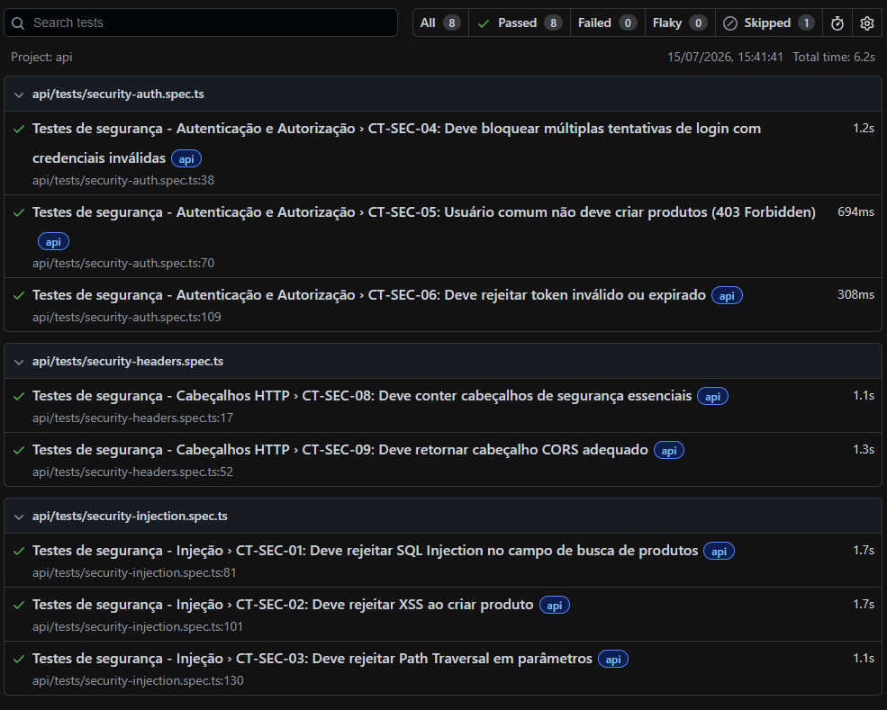

<div align="center">

# 🚀 QA Forge

### Laboratório de Engenharia de Qualidade

**API • Interface • Performance • Segurança • CI/CD**

> *Um laboratório prático onde técnicas, ferramentas e estratégias de Engenharia de Qualidade são continuamente estudadas, aplicadas e aperfeiçoadas.*

<br>

<p align="center">


</p>

<p align="center">


</p>

</div>

---

# Sobre o Projeto

O **QA Forge** é um laboratório prático de **Engenharia de Qualidade**, criado para estudar, validar e evoluir técnicas modernas de testes de software em cenários próximos aos encontrados em ambientes corporativos.

Mais do que um repositório de automação, este projeto funciona como um ambiente contínuo de experimentação, onde novas ferramentas, arquiteturas, metodologias e estratégias de testes são implementadas, avaliadas e refinadas.

Cada funcionalidade adicionada representa uma oportunidade de explorar desafios reais da Engenharia de Qualidade, sempre buscando soluções escaláveis, reutilizáveis e alinhadas às boas práticas da indústria.

---

# Experiência Aplicada

Embora o **QA Forge** seja um laboratório de estudos e experimentação, sua construção é fortemente influenciada pela minha atuação profissional em projetos reais de desenvolvimento de software, arquitetura de aplicações e garantia de qualidade.

Ao longo da minha carreira, participei do desenvolvimento de soluções corporativas utilizando tecnologias como **Java (Spring Boot)**, **Node.js**, **Angular**, **React**, **Next.js**, **PostgreSQL**, **AWS** e **GitHub Actions**, sempre conciliando o desenvolvimento de software com práticas modernas de Engenharia de Qualidade.

Essa experiência permitiu aplicar, na prática, conceitos que hoje fazem parte deste laboratório, tais como:

| Experiência Profissional | Aplicação no QA Forge |
|--------------------------|-----------------------|
| Planejamento da estratégia de testes para microsserviços | Estrutura modular da suíte de testes |
| Automação de APIs utilizando Postman e RestAssured | Implementação da camada de testes de API com Playwright |
| Testes funcionais em aplicações Angular, React e Next.js | Arquitetura de testes End-to-End utilizando Page Objects |
| Aplicação das recomendações do OWASP Top 10 | Implementação dos cenários de segurança e integração com OWASP ZAP |
| Testes em PostgreSQL | Validação de regras de negócio e consistência de dados |
| Arquitetura de microsserviços | Organização desacoplada do projeto |
| CI/CD com GitHub Actions | Pipeline automatizado de validação da qualidade |
| Secure Coding e análise estática (SAST) | Adoção de práticas de Security by Design e qualidade de código |

O QA Forge representa a convergência entre minha formação acadêmica, minha experiência profissional e meu compromisso com a evolução contínua na área de Engenharia de Qualidade.

Mais do que reproduzir exemplos encontrados em cursos, este laboratório busca transformar conhecimentos adquiridos em projetos reais em soluções práticas, reutilizáveis e alinhadas às boas práticas adotadas pela indústria de software.

## Objetivos

O QA Forge foi desenvolvido com quatro objetivos principais:

- Consolidar conhecimentos em Engenharia de Qualidade por meio da prática contínua.
- Experimentar ferramentas e tecnologias utilizadas por equipes de QA modernas.
- Simular cenários reais encontrados em aplicações corporativas.
- Construir uma base técnica sólida e pública que evidencie minha evolução profissional.

---

## Filosofia do Projeto

Este projeto é tratado como um laboratório permanente.

Novos cenários são incorporados continuamente à medida que novas tecnologias são estudadas ou desafios interessantes surgem durante minha jornada profissional.

Entre os principais temas explorados estão:

- Automação de Testes de API
- Automação de Interface (UI)
- Testes de Performance
- Testes de Segurança
- Arquiteturas de Testes
- Integração Contínua (CI/CD)
- Estratégias de Teste
- Qualidade de Código
- Observabilidade
- Engenharia de Software aplicada à Qualidade

O objetivo não é apenas automatizar testes, mas compreender profundamente como construir soluções de qualidade que sejam sustentáveis, escaláveis e confiáveis.

---

## Formação aplicada ao projeto

Grande parte das decisões técnicas adotadas neste laboratório é fundamentada nos conhecimentos adquiridos durante minha formação acadêmica e continuamente aprimorada por meio de estudos e experimentação.

| Formação | Aplicação no projeto |
|----------|----------------------|
| 🎓 Graduação em Defesa Cibernética | Testes de segurança, análise de vulnerabilidades, autenticação, autorização, validação de cabeçalhos HTTP e aplicação de princípios de Security by Design. |
| 🎓 Pós-graduação em Engenharia de Software | Arquitetura do projeto, modularização, boas práticas de desenvolvimento, reutilização de componentes, tipagem com TypeScript, qualidade de código e integração contínua. |

Essa combinação permite que o projeto evolua considerando não apenas aspectos funcionais da automação, mas também requisitos não funcionais essenciais, como segurança, desempenho, escalabilidade e manutenibilidade.

---

## Sobre este repositório

Embora o QA Forge seja um ambiente de estudos, ele também representa minha forma de demonstrar, de maneira prática, como aplico conceitos de Engenharia de Software e Engenharia de Qualidade na resolução de problemas reais.

Ao invés de apresentar apenas certificados ou conhecimento teórico, este repositório documenta minha evolução técnica por meio de implementações, experimentos, decisões arquiteturais e práticas adotadas ao longo do desenvolvimento do projeto.

Cada commit representa uma etapa da minha evolução como Engenheiro de Qualidade.
---

# Estratégia de Testes

O **QA Forge** foi projetado para validar a qualidade de software sob diferentes perspectivas, combinando testes funcionais e não funcionais em uma arquitetura modular e escalável.

Ao invés de concentrar todos os esforços em testes End-to-End, o projeto distribui as validações em diferentes camadas, permitindo identificar defeitos mais rapidamente, reduzir testes instáveis (*Flaky Tests*) e facilitar a manutenção da suíte.

As estratégias adotadas refletem práticas utilizadas em equipes modernas de **Quality Engineering**, buscando equilibrar cobertura, velocidade de execução e confiabilidade dos resultados.

---

# Matriz de Qualidade

| Categoria | Objetivo | Ferramenta | Status |
|-----------|----------|------------|:------:|
| 🌐 API Testing | CRUD, autenticação, autorização e contratos | Playwright | ✅ |
| 🖥 UI Testing | Fluxos End-to-End | Playwright | ✅ |
| 🔒 Security Testing | SQL Injection, XSS, Path Traversal e Headers | Playwright | ✅ |
| ⚡ Performance Testing | Carga e tempo de resposta | k6 | ✅ |
| 🛡 Vulnerability Scan | Scanner passivo | OWASP ZAP | ✅ |
| 📊 Test Reports | Relatórios HTML | Playwright Report | ✅ |
| 📈 Dashboards | Relatórios avançados | Allure Report | ✅ |
| 🔄 Continuous Integration | Pipeline automatizado | GitHub Actions | ✅ |
| 🧬 Mutation Testing | Qualidade da suíte de testes | Stryker | ✅ |
| 📏 Code Coverage | Cobertura de código | NYC | ✅ |
| 🧹 Code Quality | Padronização do código | ESLint + Prettier | ✅ |

---

# Arquitetura do Projeto

O QA Forge adota uma arquitetura baseada na separação de responsabilidades, permitindo que cada módulo evolua de forma independente.

```text
QA Forge
│
├── API Testing
│   ├── Cliente HTTP
│   ├── Fixtures
│   ├── Testes Funcionais
│   └── Testes de Segurança
│
├── UI Testing
│   ├── Page Objects
│   ├── Fluxos E2E
│   └── Componentes
│
├── Performance
│   └── k6
│
├── Security
│   └── OWASP ZAP
│
├── Reports
│   ├── Playwright
│   └── Allure
│
└── GitHub Actions
```

Essa organização favorece reutilização de código, baixo acoplamento e facilidade de manutenção.

---

# Stack Tecnológica

| Categoria | Tecnologia | Finalidade |
|-----------|------------|------------|
| Linguagem | TypeScript | Segurança de tipos e manutenção |
| Framework de Testes | Playwright | Automação de API e Interface |
| Performance | k6 | Testes de carga |
| Segurança | OWASP ZAP | Scanner passivo de vulnerabilidades |
| Mutation Testing | Stryker | Avaliação da qualidade dos testes |
| Cobertura | NYC | Medição de cobertura de código |
| Relatórios | Playwright Report | Evidências HTML |
| Dashboards | Allure Report | Visualização consolidada dos testes |
| Containers | Docker | Execução do ZAP |
| CI/CD | GitHub Actions | Pipeline automatizado |
| Qualidade de Código | ESLint | Análise estática |
| Formatação | Prettier | Padronização do código |
| Versionamento | Git | Controle de versões |

---

#  Arquitetura Híbrida

O projeto utiliza ambientes distintos para cada tipo de validação.

Essa abordagem reduz a dependência de uma única aplicação e aproxima o laboratório de cenários encontrados em projetos corporativos.

| Camada | Plataforma | Justificativa |
|---------|------------|---------------|
|  API | Serverest | Ambiente estável para CRUD, autenticação e contratos |
|  Interface | SauceDemo | Fluxos previsíveis para testes End-to-End |
|  Performance | SauceDemo | Avaliação de desempenho da interface |
|  Segurança | SauceDemo | Scanner passivo utilizando OWASP ZAP |

Essa estratégia proporciona:

- Menor incidência de Flaky Tests
- Maior previsibilidade
- Independência entre as camadas
- Melhor escalabilidade da suíte

---

# Estrutura do Projeto

```text
qa-forge
│
├── .github/
│   └── workflows/
│       └── ci-quality-gate.yml
│
├── allure-results/
│
├── imagens/
│
├── playwright-report/
│
├── reports/
│
├── src/
│   │
│   ├── api/
│   │   ├── client/
│   │   │   └── ApiClient.ts
│   │   │
│   │   ├── fixtures/
│   │   │
│   │   └── tests/
│   │       ├── products-crud.spec.ts
│   │       ├── products.spec.ts
│   │       ├── security-auth.spec.ts
│   │       ├── security-headers.spec.ts
│   │       └── security-injection.spec.ts
│   │
│   ├── ui/
│   │   ├── pages/
│   │   │   ├── LoginPage.ts
│   │   │   ├── InventoryPage.ts
│   │   │   ├── CartPage.ts
│   │   │   ├── CheckoutPage.ts
│   │   │   ├── cart-flow.spec.ts
│   │   │   └── checkout-flow-complete.spec.ts
│   │   │
│   │   └── tests/
│   │       └── checkout-flow.spec.ts
│   │
│   ├── performance/
│   │   └── stress-test.js
│   │
│   ├── security/
│   │   └── zap-baseline-scan.sh
│   │
│   └── utils/
│
├── test-results/
│
├── .env.example
├── playwright.config.ts
├── package.json
└── README.md
```

---

# Organização dos Diretórios

| Diretório | Responsabilidade |
|-----------|------------------|
| `.github/workflows` | Pipeline de Integração Contínua |
| `src/api/client` | Cliente HTTP reutilizável |
| `src/api/fixtures` | Massa de dados reutilizável |
| `src/api/tests` | Testes de API e Segurança |
| `src/ui/pages` | Implementação do Page Object Model |
| `src/ui/tests` | Testes End-to-End |
| `src/performance` | Scripts de Performance com k6 |
| `src/security` | Scanner OWASP ZAP |
| `reports` | Relatórios personalizados |
| `playwright-report` | Relatório HTML do Playwright |
| `allure-results` | Resultados utilizados pelo Allure |
| `test-results` | Evidências da execução |
| `imagens` | Capturas utilizadas no README |

---

# Princípios Arquiteturais

O QA Forge segue princípios de Engenharia de Software para tornar a suíte de testes mais organizada, reutilizável e escalável.

| Princípio | Aplicação |
|-----------|-----------|
| Separação de Responsabilidades | Cada módulo possui uma responsabilidade específica |
| Arquitetura Modular | API, UI, Segurança e Performance desacoplados |
| Reutilização | Cliente HTTP, Fixtures e Page Objects compartilhados |
| Escalabilidade | Novos cenários podem ser adicionados sem alterar a arquitetura |
| Baixo Acoplamento | Componentes independentes |
| Tipagem Forte | TypeScript em toda a aplicação |
| Qualidade de Código | ESLint + Prettier |
| Cobertura | Monitoramento através do NYC |
| Mutation Testing | Avaliação da eficácia da suíte utilizando Stryker |
| Segurança | Aplicação de conceitos de Security by Design |
| Integração Contínua | Execução automática via GitHub Actions |

---

# Diferenciais do Projeto

Embora seja um laboratório de estudos, sua arquitetura foi concebida para refletir práticas utilizadas em projetos reais de Engenharia de Qualidade.

Entre seus principais diferenciais estão:

- Arquitetura modular e escalável.
- Testes distribuídos entre API, Interface, Performance e Segurança.
- Cliente HTTP reutilizável.
- Utilização do padrão **Page Object Model (POM)**.
- Execução automatizada em pipeline CI/CD.
- Relatórios HTML e dashboards com Allure.
- Mutation Testing para avaliar a qualidade da suíte.
- Monitoramento de cobertura de código.
- Padronização automática do código utilizando ESLint e Prettier.
- Evolução contínua com foco em experimentação e aprendizado.

#  Primeiros Passos

## Pré-requisitos

Antes de executar o projeto, certifique-se de possuir os seguintes recursos instalados:

| Ferramenta | Versão Recomendada |
|------------|-------------------|
| Node.js | 18+ |
| npm | 9+ |
| Docker | Última versão |
| Playwright | Navegadores instalados (`npx playwright install`) |
| k6 | Para execução dos testes de performance |

---

## Instalação

Clone o repositório:

```bash
git clone https://github.com/j0hnWeider/qa-forge.git
```

Acesse o diretório do projeto:

```bash
cd qa-forge
```

Instale as dependências:

```bash
npm install
```

Instale os navegadores utilizados pelo Playwright:

```bash
npx playwright install
```

Caso necessário, copie o arquivo de variáveis de ambiente:

```bash
cp .env.example .env
```

---

# Execução

## Comandos disponíveis

| Comando | Descrição |
|----------|-----------|
| `npm run test:all` | Executa toda a suíte de testes |
| `npm run test:api` | Executa apenas os testes de API |
| `npm run test:ui` | Executa apenas os testes de Interface |
| `npm run test:perf` | Executa os testes de Performance (k6) |
| `npm run test:zap` | Executa o scanner OWASP ZAP |
| `npm run lint` | Analisa a qualidade do código |
| `npm run format` | Formata o código com Prettier |

---

# Evidências

As imagens abaixo representam a execução da suíte de testes e do pipeline no momento da elaboração desta documentação.

## Visão Geral

Todos os cenários executados com sucesso.


---

## Testes de API

Validação dos cenários funcionais e de segurança da API.


---

## Testes de Interface

Execução dos fluxos automatizados utilizando Playwright.


---

## Testes de Segurança

Execução dos cenários de autenticação, autorização e validações de segurança.


---

## Scanner OWASP ZAP

Resultado da análise passiva de vulnerabilidades.



---

## Pipeline CI/CD

Execução automática da suíte de testes através do GitHub Actions.


---

# Relatórios

Após a execução dos testes, são gerados relatórios que auxiliam na análise dos resultados.

| Relatório | Localização |
|-----------|-------------|
| Playwright HTML Report | `playwright-report/index.html` |
| Allure Results | `allure-results/` |
| Test Results | `test-results/` |
| OWASP ZAP Report | `reports/` |

# Pipeline CI/CD

Toda alteração enviada para a branch principal é validada automaticamente por meio do **GitHub Actions**, garantindo que apenas mudanças compatíveis com os critérios de qualidade sejam integradas ao projeto.

## Quality Gate

| Etapa | Objetivo |
|--------|----------|
| 📦 Instalação das dependências | Preparação do ambiente |
| 🎭 Instalação dos navegadores | Configuração do Playwright |
| 🌐 Testes de API | Validação funcional e de segurança |
| 🖥️ Testes de Interface | Execução dos fluxos End-to-End |
| ⚡ Testes de Performance | Validação dos limites definidos |
| 🔒 Scanner OWASP ZAP | Verificação passiva de vulnerabilidades |
| 📄 Geração de Relatórios | Publicação das evidências da execução |

Caso qualquer etapa crítica falhe, o pipeline é interrompido, impedindo a integração de alterações que comprometam a qualidade do projeto.

---

# Decisões Técnicas

Durante o desenvolvimento do QA Forge, algumas decisões arquiteturais foram tomadas para tornar o projeto mais organizado, reutilizável e próximo da realidade encontrada em equipes de Engenharia de Qualidade.

| Decisão | Motivação |
|----------|-----------|
| **Playwright** | Framework único para automação de API e Interface, reduzindo complexidade e facilitando a manutenção. |
| **TypeScript** | Tipagem estática para maior segurança, legibilidade e facilidade de refatoração. |
| **Arquitetura Híbrida** | Utilização de ambientes distintos para API e Interface, reduzindo flakiness e aumentando a estabilidade dos testes. |
| **Page Object Model (POM)** | Centralização dos elementos e ações da interface, promovendo reutilização e desacoplamento. |
| **Cliente HTTP Reutilizável** | Padronização das chamadas à API e redução da duplicação de código. |
| **Criação dinâmica de dados** | Geração automática de usuários e dados de teste, evitando dependência de informações fixas. |
| **OWASP ZAP Baseline** | Varredura passiva de segurança integrada ao pipeline, sem realizar testes destrutivos. |
| **GitHub Actions** | Automação da execução da suíte de testes em cada alteração do projeto. |

---

# Roadmap

O QA Forge está em constante evolução. Novos estudos e experimentações serão incorporados ao projeto conforme novas tecnologias e práticas forem exploradas.

| Funcionalidade | Status |
|----------------|:------:|
| Testes de Contrato com Pact | ⏳ |
| Testes de Acessibilidade com axe-core | ⏳ |
| Visual Regression Testing | ⏳ |
| Testes Mobile com Playwright | ⏳ |
| Execução Paralela Distribuída | ⏳ |
| Integração com SonarQube | ⏳ |
| Dashboard de Métricas | ⏳ |
| Testes orientados por Dados (Data Driven) | ⏳ |

---

# Contribuição

O **QA Forge** é um laboratório de estudos mantido como parte da minha evolução em Engenharia de Qualidade.

Embora o foco principal seja o aprendizado contínuo, sugestões, ideias e discussões sobre boas práticas, ferramentas e estratégias de testes são sempre bem-vindas.

Caso identifique alguma oportunidade de melhoria, fique à vontade para abrir uma **Issue** ou enviar um **Pull Request**.

---

# Licença

Este projeto está licenciado sob a licença **MIT**.

Consulte o arquivo `LICENSE` para mais informações.

---

#  Autor

## John Weider

Engenheiro de Qualidade em constante evolução, com experiência em desenvolvimento de software e interesse nas áreas de automação de testes, segurança de aplicações e integração contínua.

O QA Forge representa minha jornada prática de aprendizado, reunindo experimentos, estudos e implementações voltadas à construção de soluções de qualidade utilizando ferramentas e práticas adotadas pelo mercado.

### Formação Acadêmica

- 🎓 Pós-graduação em Engenharia de Software
- 🎓 Graduação em Defesa Cibernética

### Áreas de Interesse

- Engenharia de Qualidade
- Automação de Testes
- Testes de API
- Testes End-to-End
- Performance Testing
- Application Security
- DevSecOps
- Integração Contínua

### Contato

- 💼 **LinkedIn:** https://www.linkedin.com/in/john-weider-98bb041b2/
- 📧 **E-mail:** zeus.programador@gmail.com

---

<div align="center">

### ⭐ Obrigado por visitar o QA Forge!

Se este projeto foi útil ou despertou seu interesse, considere deixar uma ⭐ no repositório.

**Construindo qualidade através da prática, experimentação e aprendizado contínuo.**

</div>